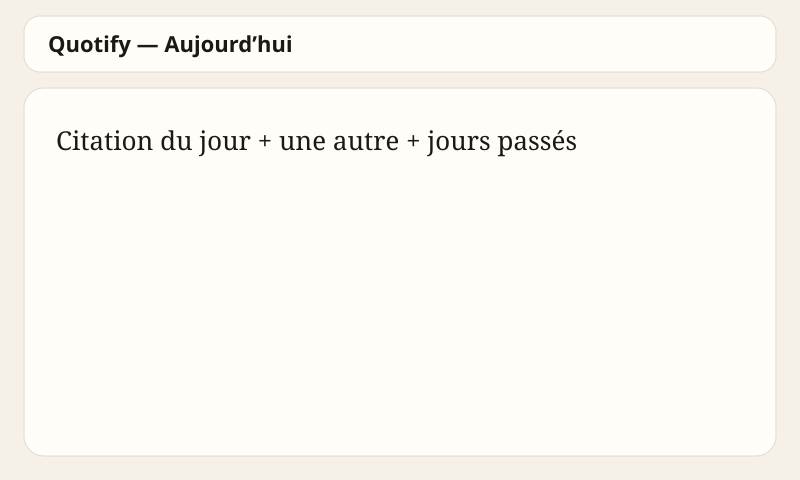
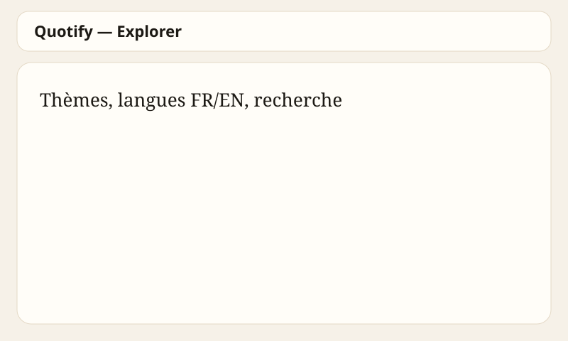
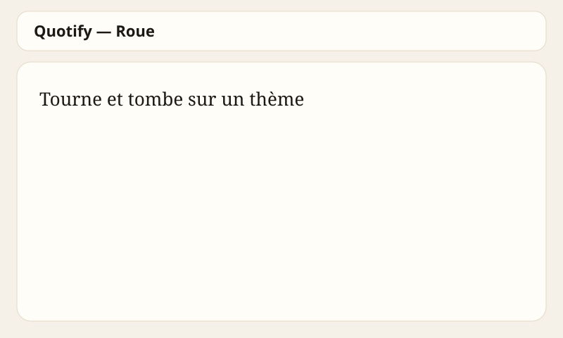

# Quotify

Une citation inspirante, chaque jour.

Site web + application (PWA). Open source. Pas de compte.

## Captures

Accueil (citation du jour, historique) :



Explorer (thèmes et langues) :



Roue :



## Lancer en local

```bash
git clone https://github.com/ouedraogojudicael227-blip/Quotify.git
cd Quotify
python3 -m http.server 8080
```

Ouvre `http://localhost:8080` ou `index.html?shell=app`.

## Fonctions

- 60 citations, thème Études, proverbes d’Afrique
- Citation du jour selon la langue + 7 jours passés
- Roue avec le nom des thèmes
- Carte image à télécharger
- Explorer : thème + filtre FR / EN
- Notification optionnelle de la citation du jour
- Favoris, copier, partager
- Clair / sombre, hors-ligne

## Branches

- `main` protégée
- `develop` pour le travail

## Contribuer

Lis [CONTRIBUTING.md](CONTRIBUTING.md). Ajoute des citations dans `js/data.js`.

## Licence

[MIT](LICENSE)
